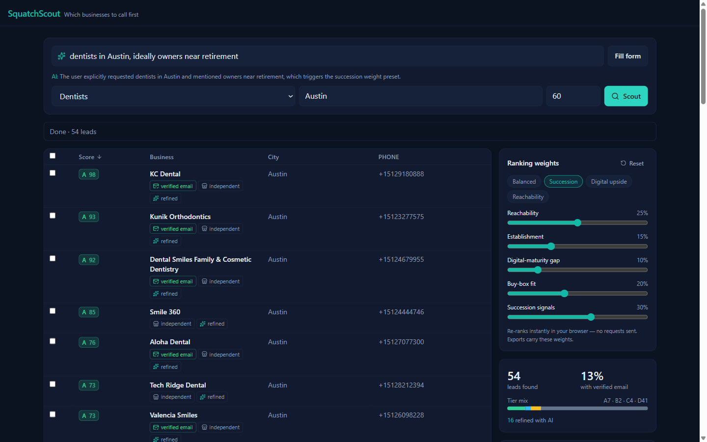
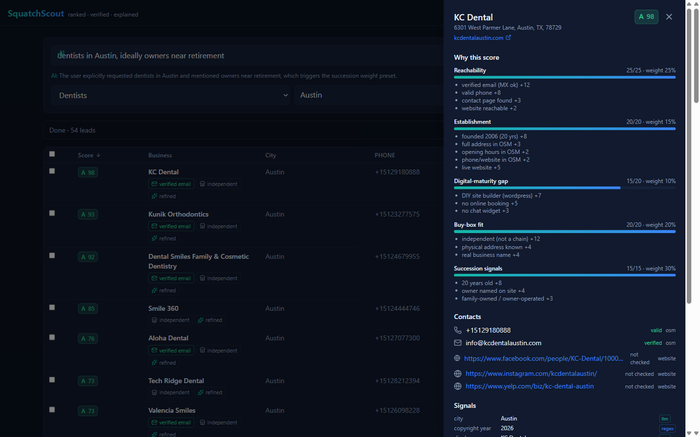

# SquatchScout

**Which small business should a buyer call first?** SquatchScout answers that with a
ranked, verified, explained list instead of a spreadsheet of names.



## Live demo

| | |
|---|---|
| App | <https://squatchscout-omega.vercel.app> |
| API health | <https://api.100-51-99-130.sslip.io/healthz> |
| Notebook walkthrough | [`notebooks/demo.ipynb`](notebooks/demo.ipynb) |
| Sample export | [`data/`](data/README.md) |
| Extraction eval | [`evals/`](evals/README.md) |

Try **Dentists / Austin, TX / 60**. The first run takes about 90 seconds and returns 54
businesses; running the same search again takes about 4, because three separate caches sit
behind it.

The AI features run on a free Groq tier. If the daily budget is spent, the natural-language
box and the *refined* badges stop appearing. The table is still complete and correctly
ranked, because refinement improves rows rather than producing them.

## The problem, and who has it

An acquisition entrepreneur, or "searcher", raises money to buy **one** small business and
run it. Their bottleneck is not finding companies, it is triage. There are four hundred
dentists in Austin and time to call maybe twenty.

SaaSquatch Leads and tools like it return the list. They do not tell you where to start.
SquatchScout adds the missing layer: every lead carries a score from 0 to 100, and every
point of that score has a stated reason you can disagree with.

The unusual part is that **a missing website counts in a business's favour**. A profitable
local firm whose owner never built one is a firm not being run for growth, which is exactly
the profile worth a phone call. Most lead tools treat that as a data gap; here it is the
`digital_gap` factor, and it is worth up to 20 points. See [Scoring](#scoring-model).

## What it does, in six steps

1. **Geocode** the location with Nominatim, shrinking oversized bounding boxes.
2. **Discover** businesses from OpenStreetMap via Overpass, across two mirrors.
3. **Dedupe** fuzzily and flag chains, using repeated names and OSM `brand` tags.
4. **Enrich** by crawling each business's own site: robots.txt honoured, three pages
   maximum, one request in flight per domain.
5. **Verify** what it found. Emails get an MX lookup and a disposable-domain check; phones
   go through `phonenumbers`. Nothing structured is ever written by a language model.
6. **Score and stream.** Five weighted factors, and every lead is pushed to the browser the
   moment it is ready rather than at the end.

## Architecture

```
 Browser (static Vite build on Vercel's CDN)
   │  HTTPS: fetch + EventSource
   ▼
 Caddy — automatic HTTPS reverse proxy        Ubuntu 24.04 on an AWS EC2 t3.micro
   ▼                                          Docker Compose: api · postgres · caddy
 FastAPI on uvicorn, one worker
   ├─ Pipeline runner (async)
   ├─ LLM client: Groq, model pool behind a token bucket
   └─ SQLModel / SQLAlchemy + Alembic
   ▼
 Postgres 16 in a Docker volume

 Outbound: Nominatim · Overpass (2 mirrors) · the businesses' own sites · DNS MX · Groq
```

The UI is static files, so it belongs on a CDN. The API cannot be: one search holds a
stream open for a minute and a half of rate-limited outbound crawling, which is a
long-lived process with in-memory state and the opposite of a good serverless workload.

[`docs/architecture.md`](docs/architecture.md) has the sequence diagram, the event contract
and the module map.

## Stack

| Layer | Choice |
|---|---|
| API | Python 3.13, FastAPI 0.116, uvicorn 0.35 |
| Data | SQLModel 0.0.24 on SQLAlchemy, Alembic 1.16, Postgres 16, psycopg 3.2 |
| HTTP & parsing | httpx 0.28, selectolax 0.3, rapidfuzz 3.13, phonenumbers 9.0, dnspython 2.7 |
| Streaming | sse-starlette 2.4 |
| AI | groq 0.31 against the Groq free tier |
| Web | Node 24, pnpm, Vite 8, React 19, TypeScript 6, Tailwind 4, TanStack Table 9 |
| Tests | pytest 8.4 with respx; vitest 5 with Testing Library and jsdom |
| Lint | ruff 0.12; oxlint 1.81 |
| Infra | Docker Compose, Caddy 2, AWS EC2, Vercel, GitHub Actions |

## Data sources and ethics

Business records come from **OpenStreetMap** via Nominatim and Overpass.

> Data © OpenStreetMap contributors, available under the
> [Open Database License](https://opendatacommons.org/licenses/odbl/).

That attribution is in the app footer and in the first row of every export.

Contact details come from two places only: the OSM record, and the business's **own
website**. The crawler declares itself with a named user agent and a contact address,
honours `robots.txt`, fetches at most three pages per domain with one request in flight,
caps bodies at 1 MB and stops at a six-second timeout. There is no LinkedIn scraping, no
people-search source, no CAPTCHA circumvention and no personal or residential data.
Searches and their leads are purged after 30 days.

Some sites return 403 to a declared bot. Those leads are marked `unreachable` and score on
map data alone; the tool does not disguise its user agent to get past that.

**An honest coverage number.** In the Austin dentist run shipped in `data/`, **18 of 54**
OpenStreetMap records carried a website tag at all, and 7 leads ended up with an
MX-verified email. That is the real ceiling on any tool built from this data, and it is why
`reachability` carries the single largest weight.

## Scoring model

| Factor | Max | What earns points |
|---|---|---|
| `reachability` | 25 | Verified email, valid phone, a contact page, a site that answers |
| `establishment` | 20 | A stated founding year, a full address, opening hours, a live site |
| `digital_gap` | 20 | No website, a DIY site builder, no online booking, no chat widget |
| `buybox` | 20 | Independent rather than a chain, a real business name, a physical address |
| `succession` | 15 | Age of the business, a named owner, family-owned or owner-operated |

Tiers are A at 70 and above, B at 55, C at 40, D below that.



Opening a lead shows where every point came from, which contact survived verification and
whether each signal was found by a regular expression or by the model.

The weights are a **starting point, not a verdict**. Dragging a slider re-ranks the whole
table in the browser with no network request, because each lead carries its factor points
and the total is just a weighted sum. The server computes the same sum in `score.py` and
the browser in `rank.ts`, and both are tested against one shared fixture,
`api/tests/fixtures/golden_scores.json`. The notebook checks the same property against a
live run and reports a maximum disagreement of 0.00 points across 54 leads.

## AI design

Three narrow uses, in order of how much they matter:

1. **Extraction.** Reads a crawled page and returns founding year, owner, family ownership
   and chain status as strict JSON.
2. **Intent.** Turns "dentists in Austin whose owners are near retirement" into an industry,
   a location and a weighting preset. It fills the form; it never touches the data.
3. **Call opener.** Three lines, grounded only in the signals already shown in the drawer.

**It is gated.** Extraction runs only when the regular expressions leave a gap worth
filling, or the page text is too thin to trust. In the Austin run, 16 of 54 leads reached
the model.

**It is throttled.** A per-model token bucket sits under the free tier's limits, a 429
retries once honouring `retry-after` then falls to the next model in the pool, results are
cached by domain for seven days, and a daily soft cap stops the day's spending. Extraction
runs at `temperature=0`.

**It is not trusted.** Every field is validated against the page before storage, structured
values are never model-generated, and each signal in the drawer is labelled `regex` or
`llm` so you can see where it came from.

### Does it actually help? Measured, not asserted

Sixteen real homepages, hand-labelled, in [`evals/`](evals/README.md):

| Field | Regex only | Regex + LLM |
|---|---|---|
| `founded_year` | 14/16 | 15/16 |
| `owner_operated` | 11/16 | 14/16 |
| `family_owned` | 5/16 | 4/16 |
| `is_chain` | 1/16 | 8/16 |
| **Overall** | **31/64** | **41/64** |

Almost the entire gain is `is_chain`, a field the regex layer does not have at all. The
model also loses ground on `family_owned` by answering on pages that say nothing. That is
why the AI is scoped to gap-filling rather than put in front of the pipeline.

The eval paid for itself twice. It caught that extraction was running non-deterministically,
and it caught that writing detailed field descriptions into the schema changed one judgment
out of 64 while costing 400 tokens a call, so that change was reverted. It also caught one
of my own labels being wrong.

### Why not more AI

The model is the least reliable and most expensive component here, so it does the smallest
possible job. Ranking is arithmetic because arithmetic is inspectable, testable and instant
in the browser. Phone numbers and emails are parsed by libraries built for that, because a
hallucinated phone number is worse than no phone number.

## Database

Eight tables, via SQLModel with Alembic migrations.

| Table | Holds |
|---|---|
| `searches` | One row per search: query, geocoded name, status, counts |
| `leads` | One business in one search, with its score and tier |
| `contacts` | Emails, phones and social links with source and verification status |
| `signals` | Every extracted fact with its provenance and confidence |
| `factor_scores` | Per-factor points and the reasons behind them |
| `geocode_cache` | Nominatim results |
| `overpass_cache` | Overpass responses, 24 hours |
| `enrichment_cache` | Crawled text, regex and LLM signals per domain, 7 days |

`DATABASE_URL` selects the backend: Postgres in production, SQLite for tests. `db.py`
enables SQLite's foreign-key pragma explicitly so the two behave alike, which has already
caught one real ordering bug.

## Caching and performance

Three caches. Measured on the deployed instance, running Dentists / Austin / 60 twice:

| | Wall clock | Leads |
|---|---|---|
| Cold, nothing cached | 92 s | 54 |
| The same search again | 4 s | 54 |

The same pair measured locally against SQLite was 137 s and 36 s; the server is faster warm
because Postgres and a Linux filesystem beat SQLite on Windows for the read-heavy replay.

Overpass responses live 24 hours, geocodes indefinitely, and crawled pages with their
extracted signals seven days per domain. Crawling is capped at eight concurrent requests
globally and one per domain, which is the real limit on a cold run.

## Hosting and deployment

A **single Ubuntu 24.04 EC2 `t3.micro`** runs Docker Compose with three services: the API,
Postgres 16 and Caddy. Caddy terminates TLS and renews certificates itself. The instance
has an Elastic IP so the hostname survives a reboot, IMDSv2 is required, and the AMI ships
with SSH password authentication already disabled.

**Static, serverless or persistent?** All three, deliberately. The front end is *static* on
Vercel's CDN because it is files. The API is *persistent* because a search holds an SSE
connection open for ninety seconds of rate-limited crawling, which exceeds serverless
execution limits and does not suit stateless invocations. *Serverless* would have been the
cheaper answer for a CRUD API; it is the wrong answer for this one. Postgres sits on the
same box to keep the demo self-contained; moving to a managed instance is a `DATABASE_URL`
change and no code change.

**The pipeline.** A push to `main` runs CI (ruff, pytest, typecheck, vitest, production
build). A green CI run triggers the deploy workflow, which SSHes to the VM and runs
`deploy/deploy.sh`: fetch, resolve the ref against `origin`, rebuild, restart, then poll
`/healthz` until `version` reports the requested commit. If it never does, the script
redeploys the previous SHA from `.deployed_sha` on its own.

**One thing is deliberately not finished.** Automatic deployment is not switched on,
because GitHub's runners connect from ephemeral IP addresses and enabling it as designed
means opening port 22 to the entire internet. The security group currently allows SSH from
one address. Deploys are run by hand with the same script CI would use, and the deploy
workflow detects the missing secret and skips with a notice rather than failing. The fix is
to deploy through AWS Systems Manager with short-lived credentials and no inbound SSH at
all; that is the next piece of work, not a step that was forgotten.

**In production this would differ.** Managed Postgres with point-in-time recovery, a real
job queue instead of asyncio tasks so refinement survives a restart, more than one API
replica behind a load balancer, a paid LLM tier, error tracking, and discovery from a
commercial source rather than only OpenStreetMap.

[`docs/runbook.md`](docs/runbook.md) covers status, logs, deploys, rollbacks, migrations,
backups, key rotation, disk pressure, certificates and the known limits.

## Local setup

```bash
# API
cd api
python -m venv .venv && .venv/Scripts/pip install -e ".[dev]"   # bin/ on POSIX
cp .env.example .env            # optional: add GROQ_API_KEY to enable the AI features
.venv/Scripts/alembic upgrade head
.venv/Scripts/uvicorn app.main:app --reload

# Web, in a second terminal
cd web
pnpm install
pnpm dev                        # http://localhost:5173
```

Or bring up API and Postgres together in Docker:

```bash
cd deploy
docker compose -f docker-compose.yml -f docker-compose.local.yml up -d --build
```

## Tests

```bash
cd api && .venv/Scripts/pytest -q && .venv/Scripts/ruff check .
cd web && pnpm typecheck && pnpm test && pnpm build
```

**85 API tests** and **22 web tests**, all run in CI on every push.

Covered: the scoring maths against a golden fixture shared with the TypeScript
implementation, every pipeline stage with mocked HTTP through respx, the LLM client's
throttling and fallback behaviour, export shapes, the SSE reducer, and the drawer's focus
trap and keyboard behaviour. No test makes a network call.

Deliberately not covered: end-to-end browser tests. The UI was verified by hand at three
widths and with a full keyboard walkthrough, which is recorded in the time log. On a longer
timeline that becomes a Playwright suite.

## Time log

[`docs/time-log.md`](docs/time-log.md) records every task with actual wall-clock minutes,
written as the work happened rather than reconstructed afterwards.

| | |
|---|---|
| Core build, tasks 1 to 27 | 604 minutes, about 10 hours |
| Extended work: evals, notebook, docs, ops | 350 minutes, about 6 hours |
| **Total** | **954 minutes, about 16 hours** |

The handbook suggests roughly five hours of coding. This took three times that, and the log
says so rather than rounding down. The first ten hours are the API and the UI; the rest is
the extraction eval, the notebook, the deployment and the documentation, none of which is
code the product needs in order to run. If five hours is a hard constraint, the honest
answer is that this exceeds it.

## What I would build next

- **Deploy through AWS Systems Manager** so automatic deployment works with no inbound SSH.
- **A real job queue.** AI refinement currently lives in asyncio tasks and does not survive
  a restart. Postgres-backed jobs would make it durable and observable.
- **Let a null retract a false positive.** The eval found a case where a regex reads a year
  out of a customer review, the model correctly returns null, and the merge policy keeps the
  wrong value because it only overrides on a non-null answer.
- **A second discovery source.** OpenStreetMap coverage is the binding constraint: two
  thirds of these businesses have no website listed and some industries barely appear.
- **Saved searches and a direct HubSpot push**, replacing the CSV round trip.

## Disclosure

Built with AI-assisted tooling (Claude Code) for scaffolding, boilerplate and test
generation. The architecture, the scoring model, the review of every change, the deployment
and the testing are mine.
