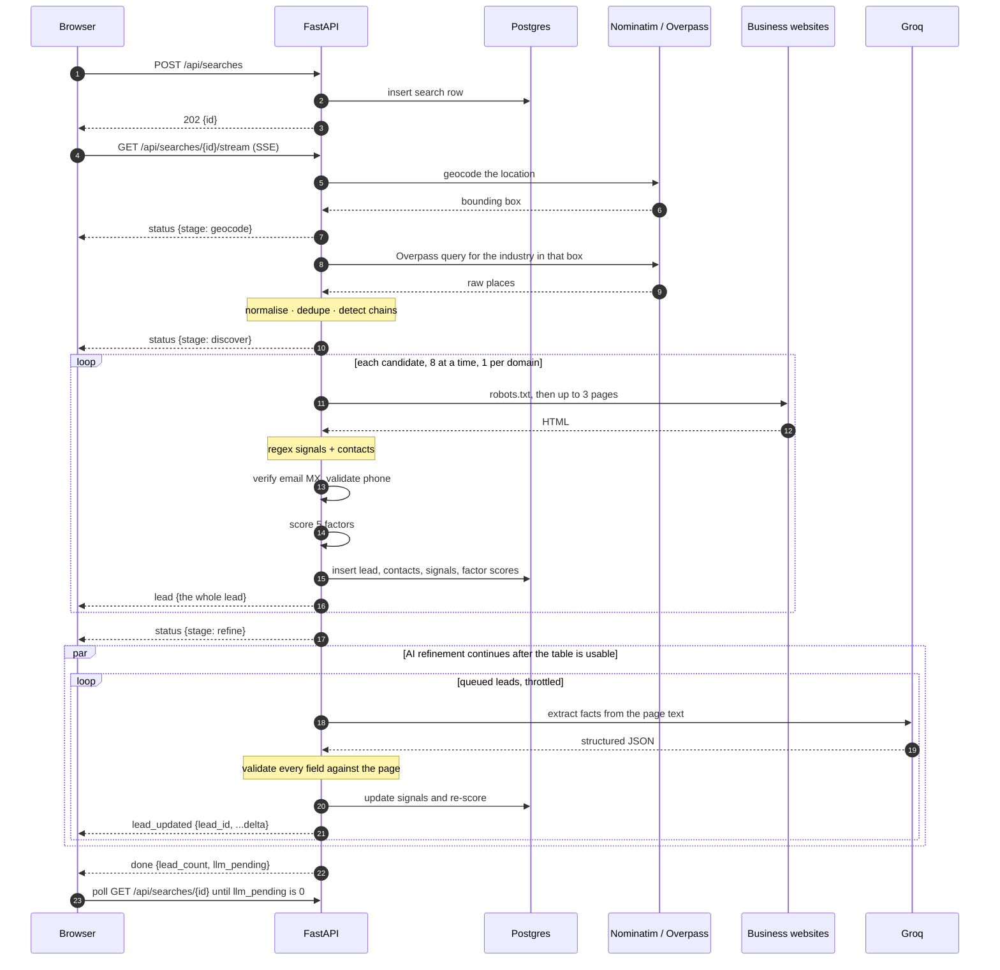

# Architecture

## The shape of it

```
 Browser (static Vite build on Vercel's CDN)
   │  HTTPS: fetch + EventSource
   ▼
 Caddy — automatic HTTPS reverse proxy        Ubuntu 24.04 on an AWS EC2 t3.micro
   ▼                                          Docker Compose: api · postgres · caddy
 FastAPI on uvicorn, one worker
   ├─ Pipeline runner (async)
   ├─ LLM client: Groq, model pool behind a token bucket
   └─ SQLModel / SQLAlchemy + Alembic
   ▼
 Postgres 16 in a Docker volume

 Outbound: Nominatim · Overpass (2 mirrors) · the businesses' own sites · DNS MX · Groq
```

**Why the UI and the API are split.** The UI is static files, so it belongs on a CDN and
costs nothing to serve. The API cannot be: a search holds an SSE connection open for two
minutes while it makes dozens of polite, rate-limited outbound crawls. That is a
long-lived process with in-memory state, which is the opposite of what a serverless
function is good at. So the API is a persistent process on a small VM.

**Why Postgres sits on the same box.** It keeps the demo self-contained and makes the
Ubuntu operations story real rather than hypothetical. `DATABASE_URL` is the only thing
that binds it, so moving to a managed Postgres is a config change and no code change. The
test suite runs against SQLite for speed, which is why `db.py` turns on SQLite's foreign
key enforcement explicitly — without it SQLite silently accepts insert orders that
Postgres rejects, and it did hide one real bug.

## One search, end to end



The important property is that `done` does not mean finished. The table is complete and
usable within seconds of discovery; the language model keeps improving rows behind it, and
each improvement arrives as its own event. A client that ignores `lead_updated` entirely
still gets a correct, ranked list.

## The event contract

| Event | Payload | When |
|---|---|---|
| `status` | `{stage, message, count}` | Entering geocode, discover, enrich or refine. |
| `lead` | the whole lead | A business has been discovered, enriched, scored and persisted. |
| `lead_updated` | `{lead_id, display_name, address, address_source, signals, factor_scores, score, tier, llm_status}` | The model finished reading that business's site and the score changed. |
| `done` | `{lead_count, llm_pending}` | Discovery and the fast path are finished. |
| `error` | `{message}` | The search failed as a whole. |

`lead` carries the lead under `id`; `lead_updated` is a **partial patch** keyed on
`lead_id`. That asymmetry is deliberate — a refinement changes a handful of fields and
resending the whole lead would be wasteful — but it is the kind of detail a client gets
wrong, and it is worth naming.

Both the web reducer and the notebook merge the patch rather than replacing the row.

## Module map

### `api/app`

| Module | Responsibility |
|---|---|
| `main.py` | App factory, lifespan, middleware order, exception handlers. |
| `config.py` | `Settings` from environment and `.env`. |
| `db.py` | Engine, `session_scope`, the SQLite foreign-key pragma. |
| `models.py` | The eight tables. |
| `schemas.py` | Request and response shapes, including `LeadOut`. |
| `deps.py` | Session dependency and the search-task launcher. |
| `logging_setup.py` | JSON log formatter and uvicorn logger wiring. |

### `api/app/pipeline`

| Module | Responsibility |
|---|---|
| `industries.py` | The curated industry list and its OSM tag selectors. |
| `geocode.py` | Nominatim lookup, bounding-box shrink, cache. |
| `discover.py` | Overpass query building, two mirrors with retry, cache. |
| `normalize.py` | Name, domain and phone normalisation. |
| `dedupe.py` | Fuzzy dedupe and chain detection across the pre-dedupe set. |
| `crawl.py` | robots.txt, polite fetching, HTML to clean text, `text_quality`. |
| `extract_regex.py` | Signals and contacts from text, with no model involved. |
| `extract_llm.py` | Gating, relevant-text selection, and the regex/model merge policy. |
| `verify.py` | Email MX plus disposable check, phone validity. |
| `score.py` | `LeadFacts`, the five factors, the weight presets. |
| `runner.py` | The orchestrator: concurrency, persistence, the LLM queue, the event stream. |

### `api/app/llm`

| Module | Responsibility |
|---|---|
| `client.py` | `LLMPool`: token bucket per model, 429 handling, model fallback, daily cap. |
| `schemas.py` | The strict JSON schemas and the validated Pydantic results. |
| `prompts.py` | The three prompts: extraction, intent, opener. |

### `web/src`

| Module | Responsibility |
|---|---|
| `api/` | Typed client, SSE wrapper, the hand-mirrored `Lead` type. |
| `state/` | `searchReducer`, `useSearchSession` with post-`done` polling. |
| `lib/rank.ts` | Client-side re-ranking, tested against the same golden fixture as `score.py`. |
| `components/` | Search bar, results table, weights panel, lead drawer, export menu. |

## The one contract shared across languages

`api/tests/fixtures/golden_scores.json` is read by both the Python scoring tests and the
TypeScript `rank.ts` tests. If the server's arithmetic and the browser's arithmetic ever
drift, both suites fail on the same fixture. The notebook checks the same property against
a live run and reports a maximum disagreement of 0.00 points.
